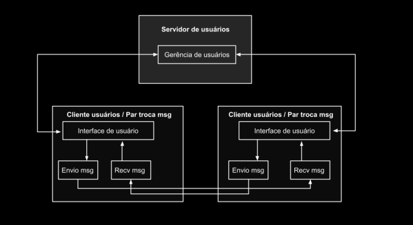
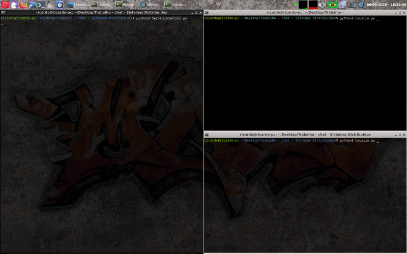
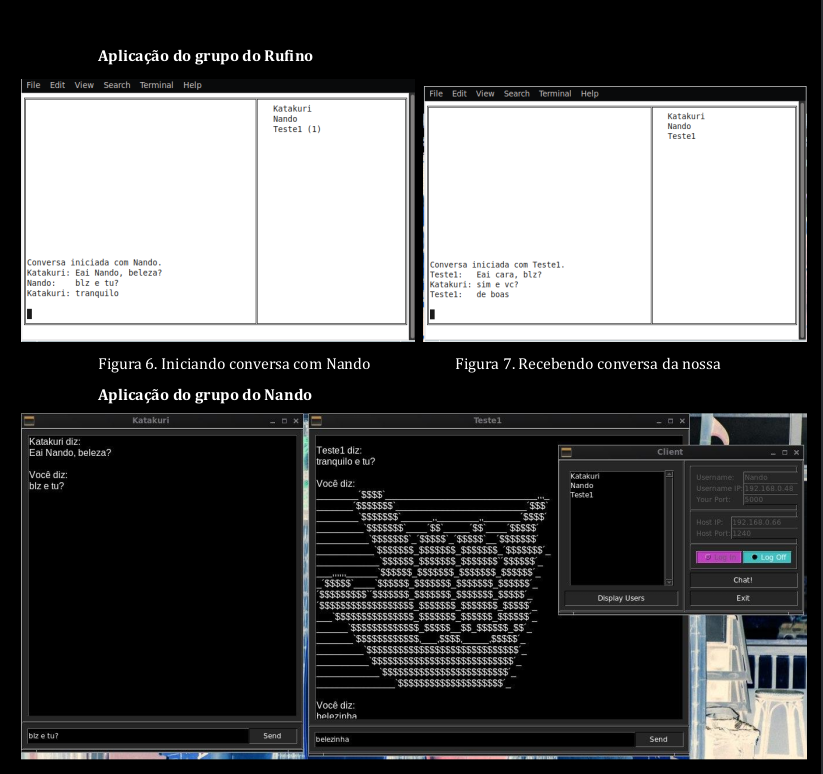
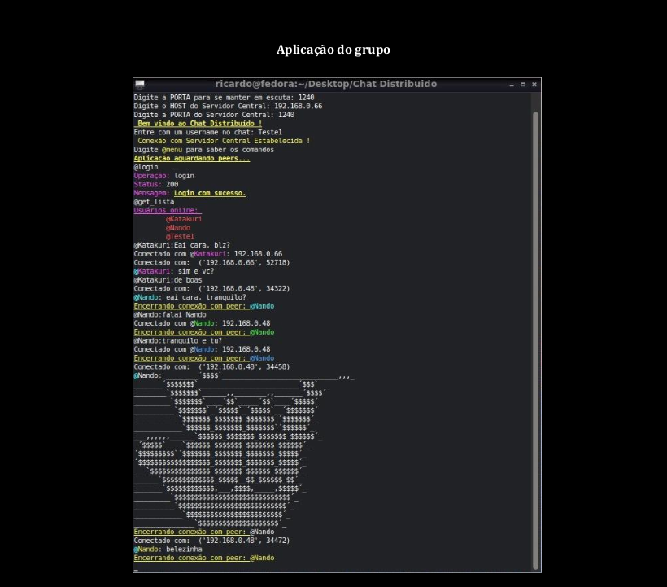
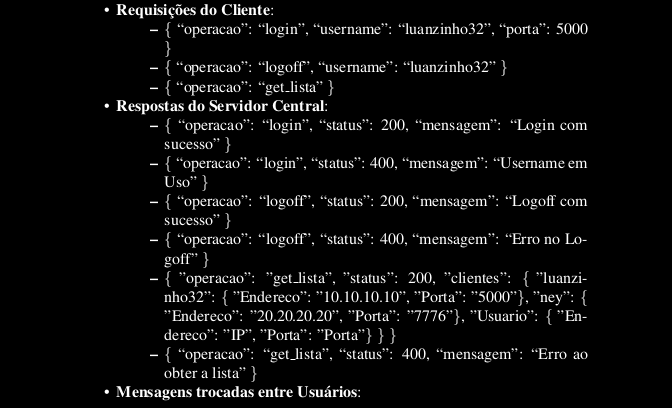
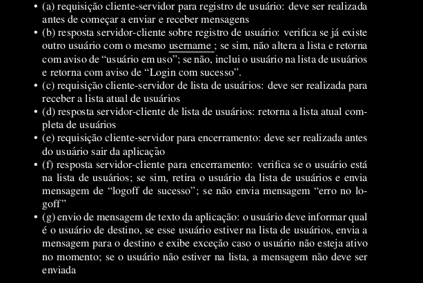

# Simples chat no Python3

#### Sistemas Distribuídos (2022 - UFRJ).

Este projeto implementa uma simples aplicação de *chat*, desenvolvida com *sockets* e *threads* no Python3,
para a turma de Sistemas Distribuídos da UFRJ, pelo curso de Ciência da Computação, no ano de 2022.

O projeto consistia de duas aplicações: 
1. Um **Servidor Central (SC)** para registrar **usuários** e fornecer informações de conexão entre aplicações.
   (`ServidorCentral.py`)
3. Uma Aplicação de **Usuário** para envio e recebimento de mensagens com **Servidor Central** e entre **usuários**.
   (`Usuario.py`)

Ambas aplicações foram implementadas de formas diferentes por diferentes grupos da turma. Logo, consistiam de
diferentes arquiteturas de Software, porém todas com o mesmo objetivo de se comunicarem entre si. 

Desse jeito, tanto um protocolo de comunicação foi estabelecido pelo instrutor(a) em aula, bem como uma arquitetura
de rede, que envolvia uma abordagem híbrida para comunicação, composta em parte por *cliente-servidor* e outra parte 
em *peer-to-peer (p2p)*.

A figura abaixo ilustra a arquitetura da rede especificada.

A comunicação entre o **Servidor Central** com as aplicações de **Usuário** foram feitas sob arquitetura 
*Cliente-Servidor*, que responde informações de conexão para um dado usuário requisitante. Com tais informações, os usuários
podem se conectar entre si, via arquitetura *peer-to-peer* para trocar mensagens.

(!) Para mais detalhes sobre a arquitetura de rede e protocolos especificados, veja o PDF de Roteiro, presente nesse repositório.

#### Funcionamento.

A aplicação desenvolvida, lembra os bate-papo *mIRC* nos *old-days*, contando com uma interface *CLI*, baseada em linhas de comandos, 
que executam em quaisquer *terminais Linux*, sob o uso de cores (realizadas em `RichTextOnTerminal.py`) para distinguir mensagens de texto (entre usuários), controle e conexão.

A animação abaixo, mostra o funcionamento do **Servidor Central**, gerenciando a comunicação entre dois usuários que se conectam (Alice e Bob) e
trocam mensagens.

Na animação, todo processamento é realizado em um mesmo computador (HOST: 192.168.0.11), porém a aplicação é desenvolvida para funcionar de forma
distribuída, isto é, com parte do processamento distribuído entre diferentes máquinas e mensagens sendo trocadas pela rede.

Para ilustrar esse funcionamento distribuído, as figuras a seguir, exibem a aplicação desse projeto se comunicando com outras aplicações de Usuário
definidas por outros grupos. 

(!) O **Servidor Central** usado na comunicação presente nas figuras acima, foi aquele implementado pelo grupo do **Rufino** - um aluno da turma.

#### Protocolo Especificado. 
Para viabilizar a comunicação entre as diferentes aplicações de Usuário (implementações cliente do projeto) entre si e com **Servidor Central**,
um protocolo de comunicação entre aplicações foi estabelecido.

>  Um protocolo define o formato e a ordem das mensagens trocadas entre duas ou mais entidades comunicantes, bem como as ações realizadas na transmissão e/ou no recebimento de uma mensagem ou outro evento (KUROSE, 6th)

Sendo assim, o protocolo desse projeto foi baseado em quatro definições:

1. Definição do **tipo** de mensagens trocadas.
   * Comunicação Usuário (cliente) - Servidor:
     - msg de requisição/resposta para **registrar usuários**
     - msg de requisição/resposta para **listar usuários**
     - msg de requisição/resposta para **encerrar conexão**

    * Comunicação Usuário - Usuário:
     - msg de texto contendo a informação entre os pares (*peers*) comunicantes.
      
2. Definição da **Sintaxe/Formato** das mensagens trocadas.
    - mensagens trocadas em formato **JSON**, determinando o tipo de *operação* em um dos campos, como segue:

    - primeiro byte das mensagens, atuando como identificador do tamanho da mensagem, para correta reserva de conexão pelo TCP.
3. Definição do **como** e **quando** os processos deviam trocar mensagens.

4. Definição do protocolo de camada de transporte usado pelas aplicações: TCP

